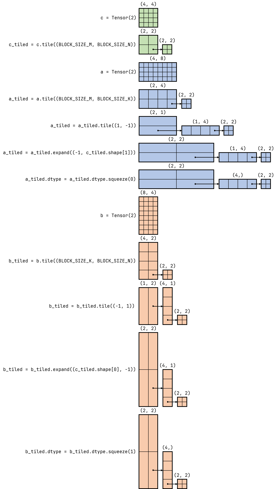

# NineToothed


A domain-specific language (DSL) based on Triton but providing higher-level abstractions.

**Other language versions: [English](README.md), [简体中文](docs/README.zh.md).**

## Installation

We can use `pip` to install `ninetoothed`.

```shell
pip install ninetoothed
```

After successfully running the above command, `ninetoothed` will be installed. However, to fully utilize its capabilities, you also need to install a deep learning framework supported by `ninetoothed`. For trial purposes, we recommend installing `torch`.

## Usage

Currently, we can use the `Tensor` and `Symbol` classes in the `ninetoothed` package to perform meta-operations like `tile` and `expand` to easily construct kernel functions. Below, we will use these features to create vector addition and matrix multiplication kernel functions.

### Vector Addition

```python
BLOCK_SIZE = Symbol("BLOCK_SIZE", meta=True)

@ninetoothed.jit
def add_kernel(
    x: Tensor(1).tile((BLOCK_SIZE,)),
    y: Tensor(1).tile((BLOCK_SIZE,)),
    z: Tensor(1).tile((BLOCK_SIZE,)),
):
    z = x + y
```

In this code, we first define `BLOCK_SIZE`, which is a `Symbol`. You can think of `"BLOCK_SIZE"` as its name. We see that `meta` is set to `True`, indicating to the compiler that it is a meta-parameter and its value can be determined by the compiler. The `Tensor(1)` constructs a one-dimensional tensor (vector), and `Tensor(1).tile((BLOCK_SIZE,))` means we want to create a vector and divide it into blocks of size `BLOCK_SIZE`. Suppose the size of this vector is `8192` and `BLOCK_SIZE` is `1024`, then the vector will be divided into `8` blocks, each of size `1024`.


By using type annotations, we tell the compiler that we will have three tensor parameters, which will be divided into blocks, and `x`, `y`, and `z` are these blocks. It's important to understand that `x`, `y`, and `z` are the blocks, not the tensors themselves. In the function body, `x`, `y`, and `z` are also the blocks. The rest is straightforward (only one line `z = x + y` left, haha), we add each block of `x` and `y` and store it in `z`. Since each block of the parameter tensors undergoes this operation, the addition is completed for the whole tensors as well.

### Matrix Multiplication

```python
BLOCK_SIZE_M = Symbol("BLOCK_SIZE_M", meta=True)
BLOCK_SIZE_N = Symbol("BLOCK_SIZE_N", meta=True)
BLOCK_SIZE_K = Symbol("BLOCK_SIZE_K", meta=True)

a_tiled = Tensor(2).tile((BLOCK_SIZE_M, BLOCK_SIZE_K)).tile((1, -1))
b_tiled = Tensor(2).tile((BLOCK_SIZE_K, BLOCK_SIZE_N)).tile((-1, 1))
c_tiled = Tensor(2).tile((BLOCK_SIZE_M, BLOCK_SIZE_N))

a_tiled = a_tiled.expand((-1, c_tiled.shape[1]))
b_tiled = b_tiled.expand((c_tiled.shape[0], -1))

a_tiled.dtype = a_tiled.dtype.squeeze(0)
b_tiled.dtype = b_tiled.dtype.squeeze(1)

@ninetoothed.jit
def matmul_kernel(a: a_tiled, b: b_tiled, c: c_tiled):
    accumulator = ninetoothed.language.zeros(
        c.shape, dtype=ninetoothed.language.float32
    )
    for k in range(a.shape[0]):
        accumulator += ninetoothed.language.dot(a[k], b[k])
    c = accumulator.to(ninetoothed.language.float16)
```

For matrix multiplication, we also have three tensor parameters, but the tiling method is more complex than vector addition. We denote the three matrices as $A$, $B$, and $C$, where $A$ and $B$ are inputs, and $C$ is the output. Tiling $C$ is simple; we just need to divide it into blocks of size `(BLOCK_SIZE_M, BLOCK_SIZE_N)` by rows and columns. Once each block computes its result, the entire $C$ is computed. However, how should we tile $A$ and $B$? The answer is to introduce another meta-parameter `BLOCK_SIZE_K`. This way, we can divide $A$ into blocks of size `(BLOCK_SIZE_M, BLOCK_SIZE_K)` and $B$ into blocks of size `(BLOCK_SIZE_K, BLOCK_SIZE_N)`. However, for matrix multiplication, $A$ and $B$ do not correspond block by block; each row of $A$ needs to correspond to each column of $B$. Therefore, we need to further `tile` $A$ and $B$ by rows and columns, respectively. Up to this point, we have a set of row blocks of $A$ and column blocks of $B$. However, each row block of $A$ must correspond to every column block of $B$. This is where `expand` comes in. We `expand` the row blocks of $A$ along the columns to the number of columns of $C$ and the column blocks of $B$ along the rows to the number of rows of $C$. This way, we successfully tile $A$, $B$, and $C$. In fact, our meta-operations up to this point have already enabled us to write kernel functions. However, we notice that the levels where the row blocks and column blocks reside, which we mentioned earlier, are two-dimensional, and their sizes are of the forms `(1, ...)` and `(..., 1)`. This means that if no other operations are performed, the way we access row blocks and column blocks would have to be `a[0, k]` and `b[k, 0]`. If we want to use `a` to find the range of `k`, we would need to use `a.shape[1]`, but we know that dimensions of size `1` can actually be removed completely. This is why we added two lines of `squeeze`. The `dtype` refers to the data type, which in PyTorch can generally be some integer or floating-point type, such as `torch.float32`. However, since meta-operations like `tile` can be performed in NineToothed, `dtype` can also be a `Tensor`. In other words, there is a concept of "tensors that store tensors" in NineToothed. In summary, these two lines perform operations on the tensors stored in the outmost tensor, removing the dimensions of size `1`. This way, when we access the row and column blocks, we can use `a[k]` and `b[k]`, and when finding the range of `k`, we can use `a.shape[0]`.



With tiling done, the rest is simple. In the function body, we define an `accumulator` to accumulate intermediate results. We then iterate through the corresponding row blocks of $A$ and column blocks of $B$, multiplying them and accumulating the results in `accumulator`. Finally, we place the `accumulator` in the corresponding block of $C$. Since each block of the parameter tensors undergoes this operation, the multiplication is completed for the whole tensors as well.

## License

This project is distributed under the Apache-2.0 license. See the included [LICENSE](LICENSE) file for details.
